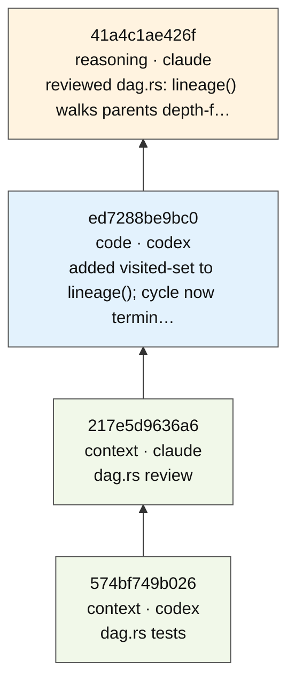
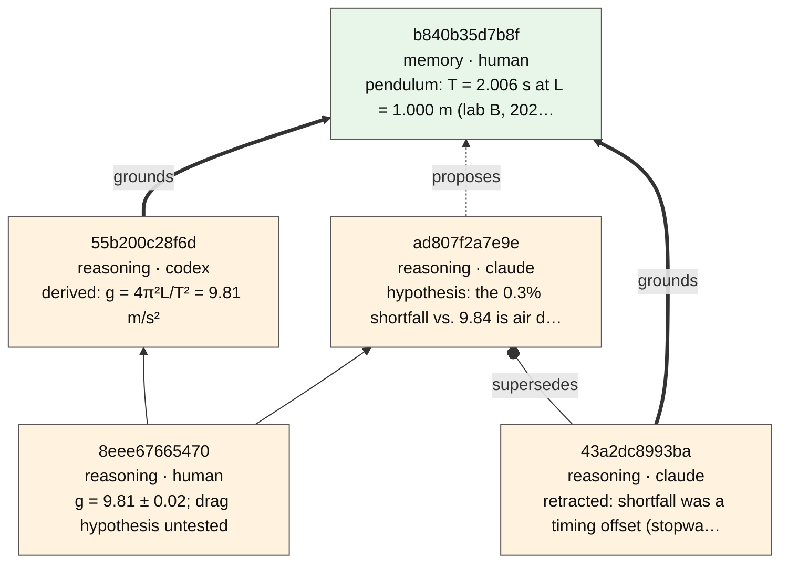
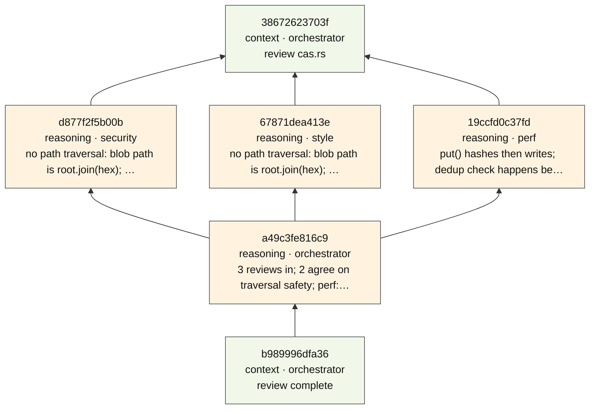

# ket + catbus in one sitting

*Context, tokens, retrieval, generation — and what changes when the substrate is content-addressed.*

You already know the four words. **Context** is what the model sees this turn.
**Tokens** are what that costs. **Retrieval** is how something gets back into
context later. **Generation** is what comes out. ket and catbus never touch
generation itself. They sit underneath it and change one thing about each of
the other three:

| | Usually | With ket + catbus |
|---|---|---|
| **Context** | a pile of text you re-paste | bytes with a 64-hex ID. Same bytes, same ID, forever. |
| **Retrieval** | "find something similar" | "give me exactly this ID" — and tell me if the file moved on since. |
| **Generation** | output, then it's gone | a node in a graph: who made it, from what, when. Lineage is a query. |
| **Tokens** | re-explain the project to every model | hand the next model a ~150-token receipt that points at everything by ID. |

Everything below is the real output of [`docs/demo.sh`](demo.sh). Run it
yourself in about five seconds:

```sh
cargo install --git https://github.com/nickjoven/ket ket-cli      # ket
cargo install --git https://github.com/nickjoven/catbus            # catbus
./docs/demo.sh            # packs ket-dag/src/lib.rs, ~32 KB of Rust
```

Dolt is optional. Without it the drift gate and the SQL projection steps are
skipped and everything else runs the same.

---

## 1. Context is content-addressed

Store a file twice. You get the same ID twice, because the ID *is* the content
(a BLAKE3 hash). `verify` re-hashes the stored bytes and compares — no oracle,
no trust.

```
$ ket put src/dag.rs
a8346e4bb9845321b0aa76528de7a3d72501333c735dea9cccfe5adfcbfc5649
$ ket put src/dag.rs
a8346e4bb9845321b0aa76528de7a3d72501333c735dea9cccfe5adfcbfc5649
$ ket verify a8346e4bb9845321b0aa76528de7a3d72501333c735dea9cccfe5adfcbfc5649
OK: a8346e4bb9845321b0aa76528de7a3d72501333c735dea9cccfe5adfcbfc5649
```

This is the whole trick. Once identity is a function of bytes, "which version
did the model see?" stops being a question anyone has to remember the answer to.

## 2. Generation leaves a trail

Two models work in sequence. Claude reviews, Codex fixes. Each output becomes
a DAG node that names its agent and its parents, so the fix *points at* the
review it came from.

```
$ ket dag create "reviewed dag.rs: lineage() walks parents depth-first; no cycle guard" \
    --kind reasoning --agent claude
$ ket dag create "added visited-set to lineage(); cycle now terminates" \
    --kind code --agent codex --parent <that-cid>

$ ket dag lineage 9bbee38be66a551caa60a9336b934d02d083f1db39fe4e3b40df728a2cdc31f2
9bbee38be66a  code  codex
  7df1d9beabcc  reasoning  claude
```

And every mutation lands in one append-only log. Read the log, and you have
the history. There is no other history.

```
$ ket log
2026-09-04T18:28:20Z | init | /tmp/tmp.PuvByQ5O4Q/.ket
2026-09-04T18:28:20Z | put | src/dag.rs -> a8346e4bb9845321b0aa76528de7a3d72501333c735dea9cccfe5adfcbfc5649
2026-09-04T18:28:20Z | put | src/dag.rs -> a8346e4bb9845321b0aa76528de7a3d72501333c735dea9cccfe5adfcbfc5649
2026-09-04T18:28:20Z | put | src/dag.rs -> a8346e4bb9845321b0aa76528de7a3d72501333c735dea9cccfe5adfcbfc5649
2026-09-04T18:28:20Z | dag:create | 7df1d9beabcce70b018637aff5527c7f253b8e64065bed88ea04bea1562a5ed8
2026-09-04T18:28:20Z | dag:create | 9bbee38be66a551caa60a9336b934d02d083f1db39fe4e3b40df728a2cdc31f2
```

## 3. Retrieval is by hash, and it knows when it is stale

Retrieval here is not similarity search. You ask for an ID and get those bytes
back, exactly. The interesting part is the other direction: a model reasoning
about `src/dag.rs` should know whether the file it was told about is still the
file on disk.

```
$ ket get a8346e4bb9845321b0aa76528de7a3d72501333c735dea9cccfe5adfcbfc5649 | head -3
//! Merkle DAG layer built on top of ket-cas.
//!
//! Each DagNode is serialized to JSON, stored in CAS, and addressable by CID.

$ ket track add src/dag.rs --agent claude
Tracking src/dag.rs (CID: a8346e4bb984)
$ ket drift
No drift detected. 1 files OK.

$ echo "// a later edit nobody told the model about" >> src/dag.rs
$ ket drift
DRIFTED (1):
  src/dag.rs expected:a8346e4bb984 actual:c22a348162cb

0 OK, 1 drifted, 0 missing
exit=1
```

The exit code is the point. `ket drift && run-agent` is a gate: the agent does
not start on stale context. Stale and fabricated context are both silent
failures; this makes one of them loud.

## 4. Tokens: hand the next model a receipt, not the transcript

This is catbus. Instead of re-sending the file, the review, and the fix to the
next model, pack a **handoff**: a summary, the artifact IDs, an optional symbol
index, and a parent link into the DAG above.

```
$ catbus pack --title "dag.rs review" \
    --summary "lineage() cycle fix landed (see parent). Next: test lineage_bounded with a cycle." \
    --agent claude --file src/dag.rs --cdom --parent 9bbee38be66a…

$ catbus handoff 134f356b7acce432a54be2e42463abad951a76986436a64b37216c7d4da01219
--- CATBUS HANDOFF ---
node: 134f356b7acce432a54be2e42463abad951a76986436a64b37216c7d4da01219
agent: claude
timestamp: 2026-09-04T18:28:21.388672203+00:00
parents:
- 9bbee38be66a551caa60a9336b934d02d083f1db39fe4e3b40df728a2cdc31f2
summary:
lineage() cycle fix landed (see parent). Next: test lineage_bounded with a cycle.
cdom: 7a9476ccae91e9b09c5f2cec4acb21e6b7843c66e9f7049dcc556b082a0a4fd3 (1 files, 61 symbols)
artifacts:
- dag.rs c22a348162cbf28cfbae5d906e71f7b546cb7b914a87f92f0b32cbb6b0e4debc
rules:
- do not recompute context already in this handoff
- if something is missing, request an updated handoff packet
```

That block is the entire context transfer. Everything else is one `ket get`
away, by ID, only if the next model actually needs it.

```
$ catbus stats 134f356b7acce432a54be2e42463abad951a76986436a64b37216c7d4da01219
                              bytes  est. tokens
handoff block                   619          155
packet json                     554          139
cdom bundle                   10801         2701
  artifact dag.rs             31675         7919
artifacts total               31675         7919
handoff is 51.2x smaller than re-sending the artifacts (~4 bytes/token)
```

Token counts are an estimate (tokenizers differ). The ratio is what matters:
the receipt costs about 150 tokens; the file it stands for costs about 8,000.
The symbol index is a middle tier, roughly a third of the file, for a model
that needs to know *what is in there* without reading it.

## 5. The second model picks up exactly there

`guard` validates the packet, prints the block, then runs the agent. `unpack`
materialises the artifacts byte-for-byte. The second model does its work and
packs its own receipt with the first as parent.

```
$ catbus guard --cid 134f356b7acc… -- your-agent-command
valid: 134f356b7acce432a54be2e42463abad951a76986436a64b37216c7d4da01219
--- CATBUS HANDOFF ---
…

$ catbus unpack 134f356b7acc… --out-dir ./handoff
$ cmp src/dag.rs handoff/dag.rs && echo 'unpacked bytes == packed bytes'
unpacked bytes == packed bytes

$ catbus pack --title "dag.rs tests" \
    --summary "lineage_bounded cycle test added; all green." \
    --agent codex --file src/dag.rs --cdom --parent 134f356b7acc…

$ catbus diff 134f356b7acc… 2f695b436e4f…
Summary changed: true
CDOM changed: true
Title: Some("dag.rs review") -> Some("dag.rs tests")
Changed artifacts:
  * dag.rs
```

Now walk the lineage from the newest receipt. It crosses both tools and both
models without either of them having been told about the other:

```
$ ket dag lineage 2f695b436e4ff4683133a1cb6e66236edc19a5e771a47a83223feeeeca7a0ac0
2f695b436e4f  context  codex
  134f356b7acc  context  claude
    9bbee38be66a  code  codex
      7df1d9beabcc  reasoning  claude
```

## 6. SQL is a projection, not a second truth

catbus wrote blobs only; it never touched the SQL side. `repair` replays the
sealed nodes into Dolt, and `verify-projection` re-derives every edge and diffs
it against the table. Throw the database away and this rebuilds it
bit-identically. That is the design test the whole substrate is held to
([DESIGN.md](../DESIGN.md)).

```
$ ket repair
  synced: 69206df074c2  context  claude
  synced: 69ceca8ae83a  context  codex

Repair: 2 synced, 2 already in sync, 0 errors
$ ket verify-projection
verify-projection: clean (projection agrees with substrate)
```

## 7. The whole thing as a graph

`ket graph --format mermaid` renders the DAG in a form GitHub draws natively.
Bottom to top: Claude's review, Codex's fix, the first handoff, the second.
Every arrow is a sealed parent link; the labels come from the content itself.



`--format dot` gives Graphviz, `--format json` gives `{nodes, edges, soft_links}`
for anything else.

---

## Domain demos

The walkthrough above is one domain: a code handoff. Two more, each a single
script in [`docs/demos/`](demos/), show what the same substrate does when the
artifacts are claims instead of files, and when the agents run at once instead
of in turn.

### Research claims: typed edges and supersession

[`demos/research-claims.sh`](demos/research-claims.sh). A measurement is an
irreducible input. One agent *derives* from it (the edge is `grounds`); another
merely *proposes* a hypothesis. A synthesis merges both. Then the hypothesis is
retracted, and the retraction is a new node whose edge to the old one is
`supersedes`. The old claim is still there, byte for byte:

```
$ ket dag create "derived: g = 4π²L/T² = 9.81 m/s²" \
    --kind reasoning --agent codex --parent <measurement> --edge-kind grounds
$ ket dag create "hypothesis: the 0.3% shortfall vs. 9.84 is air drag on the bob" \
    --kind reasoning --agent claude --parent <measurement> --edge-kind proposes
$ ket merge "g = 9.81 ± 0.02; drag hypothesis untested" --parents <derived> <hypothesis>
$ ket dag create "retracted: shortfall was a timing offset (stopwatch latency), not drag" \
    --kind reasoning --agent claude --parent <hypothesis>:supersedes --parent <measurement>:grounds

$ ket get <hypothesis-output-cid>
hypothesis: the 0.3% shortfall vs. 9.84 is air drag on the bob
```

Resolution is an event in the log, never an overwrite. The `supersedes` edge is
part of the retraction node's own bytes, so "this replaces that" has a CID and
rebuilds with everything else. Bold edges are `grounds`, dashed are `proposes`,
plain are `derives`, circle-headed is `supersedes`:



Why it matters: the edge kind is part of the node's bytes, so it is part of its
CID. "This was proposed, not derived" cannot drift out of sync with the graph,
because it *is* the graph.

### Parallel review: fan out, fan in, nothing to lock

[`demos/parallel-review.sh`](demos/parallel-review.sh). One handoff. Three
reviewers start from it **at the same time**, as separate processes writing to
the same store. Then a merge node fans them back in and the orchestrator hands
off again.

```
$ catbus pack --title "review cas.rs" --summary "Review src/cas.rs for security, performance, and style." \
    --agent orchestrator --file src/cas.rs --cdom
# three background processes, each: ket dag create <finding> --parent <handoff>
security -> d877f2f5b00b…
perf     -> 19ccfd0c37fd…
style    -> 67871dea413e…

security output_cid: cf7f3adbfd0f…
style    output_cid: cf7f3adbfd0f…
same bytes, same CID: stored once.

$ ket merge "3 reviews in; 2 agree on traversal safety; perf: dedup-before-write confirmed. Ship." \
    --parents <security> <perf> <style> --agent orchestrator
$ ket log
2026-09-04T18:56:13Z | init | /tmp/tmp.mSxllOR7tN/.ket
2026-09-04T18:56:13Z | dag:create | 38672623703f… (catbus pack)
2026-09-04T18:56:13Z | dag:create | d877f2f5b00b…
2026-09-04T18:56:13Z | dag:create | 19ccfd0c37fd…
2026-09-04T18:56:13Z | dag:create | 67871dea413e…
2026-09-04T18:56:13Z | merge | a49c3fe816c9… (3 parents)
2026-09-04T18:56:13Z | dag:create | b989996dfa36… (catbus pack)
$ ket verify-projection
verify-projection: clean (projection agrees with substrate)
```

There is no lock and no merge conflict, because nothing is ever overwritten:
every write is a new blob named by its own hash. Two reviewers who reach the
identical finding produce one blob, and the graph shows two nodes pointing at
it. The log is append-only with a trailing-newline guard, so interleaved
writers land one line each.



**This demo is also a test.** The first time it ran, two reviewers writing the
same bytes at the same instant collided on a shared temp file inside the store
and one of them failed. That was a real race in `ket-cas`, fixed the same day,
with a concurrent test to keep it fixed. A demo that exercises the substrate
the way agents actually use it is worth more than one that only shows the
happy path.

---

## What you just saw, in the four words

- **Context** became bytes with an identity you can verify, instead of text you re-paste.
- **Retrieval** became exact, with a gate that refuses stale input.
- **Generation** became a graph you can walk backwards, across models.
- **Tokens** dropped from the size of the project to the size of a receipt.
- **Agents in parallel** write to one store with no locks and no conflicts, and the graph shows who did what.

Next steps: [README](../README.md) for the full command surface and the MCP
tools that expose all of this to Claude directly. [catbus](https://github.com/nickjoven/catbus)
for the handoff CLI on its own.
